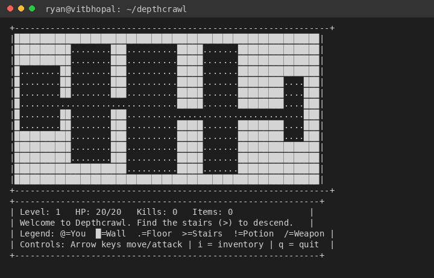

# Depthcrawl

A turn-based roguelike dungeon crawler that runs

entirely in the terminal. Every run creates a genuinely different

dungeon layout (using Binary Space Partitioning), enemy difficulty scales

with depth, and death is permanent.

## Features

- Procedural dungeon generation — BSP (Binary Space Partitioning)

recursively splits the map into rooms and connects them with

corridors, so no two runs have the same layout

- Turn-based combat — walk into a monster to attack it; damage is

randomized within a range and reduced by the defender's defense stat

- Fog of war — only tiles you've actually explored are visible

- Inventory & items — potions, weapons, and armor found in rooms,

auto-used on pickup

- Difficulty scaling — monster HP/attack and type mix get tougher

the deeper you go

- Persistent high scores — depth reached, kills, and turns taken

are saved to a local JSON file after every run

- Bordered terminal UI — a bounded map panel and a HUD panel

(stats, message log, symbol legend, controls) rendered with `curses`

## Technologies used

- Python 3 (standard library only: `curses`, `random`, `json`, `math`,

`locale`, `unittest`)

- No external dependencies on macOS/Linux

- `windows-curses` (pip package) required on Windows only, since

`curses` isn't bundled with Windows Python

## Project structure

```

depthcrawl/

├── main.py       # game loop / entry point

├── dungeon.py       # BSP procedural map generation

├── entities.py       # Player & Monster classes

├── combat.py        # turn-based damage resolution

├── items.py         # item spawning & use effects

├── fov.py           # fog of war visibility

├── storage.py         # JSON high-score persistence

├── render.py          # curses drawing (map + HUD panels)

├── constants.py         # tunable config in one place

├── tests/             # unit tests (14 tests)

├── README.md

├── statement.md

└── report.pdf

```

## Setup & installation

1. Requirements: Python 3.8+.

2. Clone the repository:

```bash

git clone https://github.com//depthcrawl.git

cd depthcrawl

```

3. Windows only — install curses support (not bundled with Windows Python):

```powershell

pip install windows-curses

```

macOS/Linux need nothing extra — `curses` is part of the standard library there.

4. Windows only — before running, set your terminal to UTF-8 so the

wall character renders correctly:

```powershell

[Console]::OutputEncoding = [System.Text.Encoding]::UTF8

```

## Running the project

Run from a real terminal (not an editor's "Run" button/output panel —

`curses` needs raw keyboard input, which most one-shot run panels

don't forward):

```bash

python3 main.py

```

Minimum terminal size: 62 columns x 22 rows (default terminal

windows are comfortably larger than this). If your terminal is too

small, the game will tell you on startup instead of rendering

incorrectly.

### Controls

| Key | Action |

|---|---|

| Arrow keys | Move / attack (walk into a monster to fight it) |

| `i` | Open inventory (press any key to go back) |

| `q` | Quit |

### Symbol legend

| Symbol | Meaning |

|---|---|

| `@` | You |

| `█` | Wall |

| `.` | Floor |

| `>` | Stairs down |

| `!` | Potion (heals) |

| `/` | Weapon (raises attack) |

| `[` | Armor (raises defense) |

| letters (`r`/`g`/`s`/`O`) | Monster (rat/goblin/skeleton/ogre) |

## Screenshots



A procedurally generated dungeon (bordered map panel) with the HUD

panel below showing stats, the message log, the symbol legend, and

controls.

## Testing

```bash

python3 -m unittest discover tests -v

```

14 tests cover dungeon generation (connectivity, room validity,

out-of-bounds tile handling), combat math (damage bounds, kill/death

resolution), and item logic (spawn placement, all three item effects).

`main.py` and `render.py` aren't unit tested directly since they need

a live terminal — they were verified through manual play-testing

instead.

## Design notes

- The dungeon is a 2D list of characters, not a database — the whole

map fits comfortably in memory and JSON serialization was never

needed for the map itself (only for high scores).

- `tile_at()` in `dungeon.py` exists specifically to avoid a class of

bug where negative coordinates (e.g. walking into the top wall)

would silently wrap around to the opposite edge of the map via

Python's list indexing — an early version of this project had that

exact bug, caught and fixed during testing (see `test_dungeon.py`,

`test_tile_at_returns_none_out_of_bounds`).

- Rendering uses two separate `curses` windows (map + HUD) updated

with `noutrefresh()` + a single `doupdate()` per frame, rather than

refreshing each window (or `stdscr`) individually — the latter

causes visible flicker and, in one combination, can wipe out

already-drawn windows entirely.
